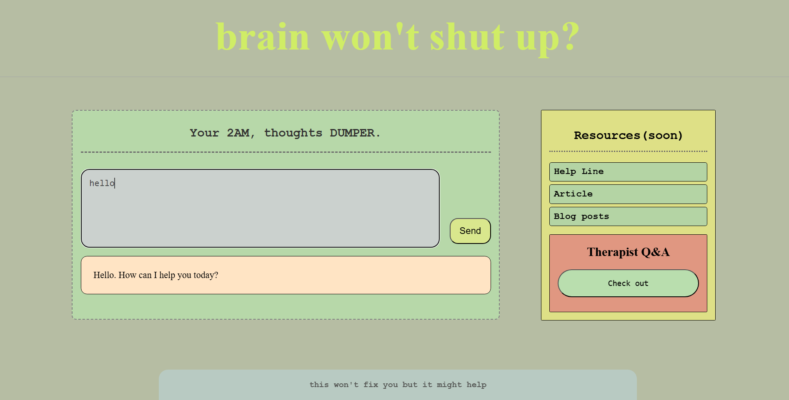
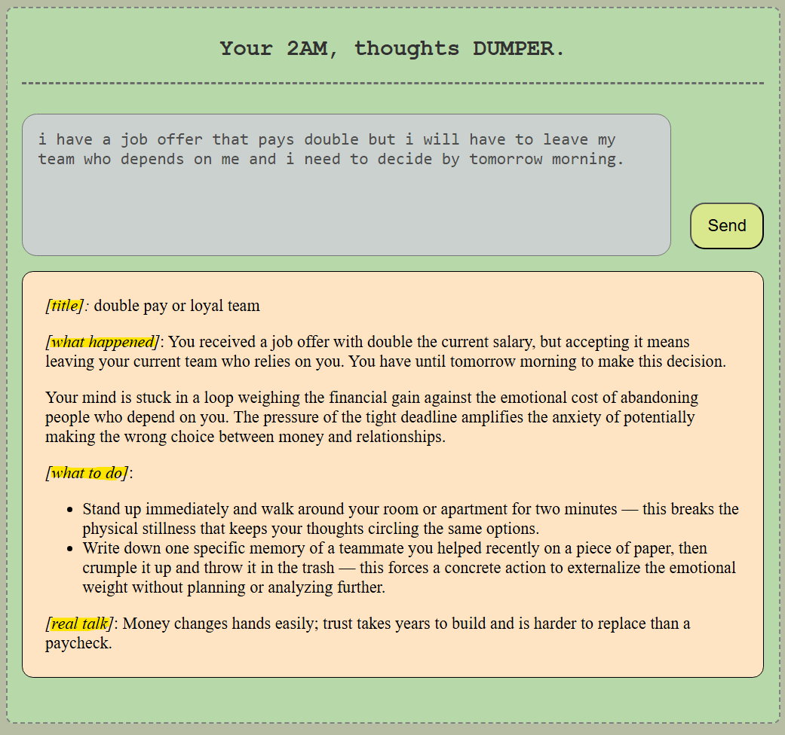
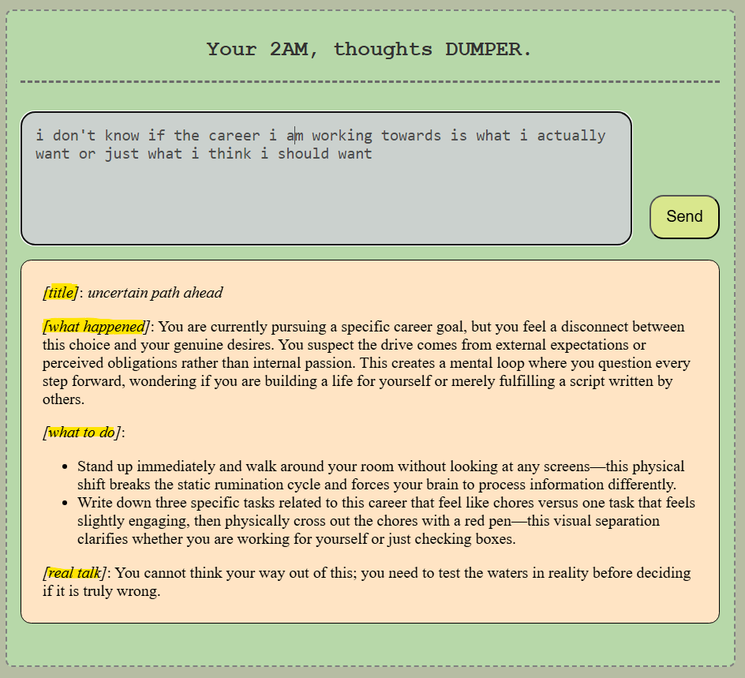

# late-night-thought-dump 🌙

A web app for when your brain won't shut up at 2am.

Type what's eating you alive. Get a structured, no-fluff response. No toxic positivity. Just clarity.

## preview


---
A space for when your brain won't shut up at 2am.

Dump your thought. Get a structured breakdown — what happened, what to do right now, and a real talk that doesn't sugarcoat it.



*When the deadline is tomorrow and your brain won't pick a side*
---



*Dump your thought, get clarity - not comfort*
---
No journaling prompts. No motivational quotes. Just clarity when you need it most.
## requirements
- [LM Studio](https://lmstudio.ai/) running locally with a model loaded
- CORS enabled in LM Studio server settings
- Use provided system instruction

## setup
```bash
npm install
npm run dev
```

In `src/Input-component/TakeInput.jsx`, replace the model name with yours:
```js
model: "your-model-name-here"
```

## stack
React + Vite + LM Studio (local AI)